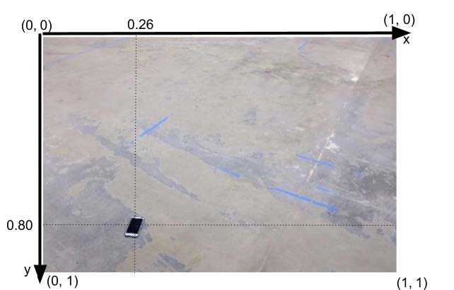
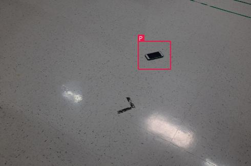

# SSD: Single Shot MultiBox Detector for Single Class Detection

## Task Description
There is only one type of phone that is interested in detecting. Here is an example of a image with a phone on it:

Consider a normalized XY-coordinate system for an image. Left-top corner of the image is defined as (x, y) = (0, 0),  left-bottom as (x, y) = (0, 1), right-top as (x, y) = (1, 0), and finally right-bottom corner as (x, y) = (1, 1). 
Your “phone detector” has to find normalized coordinates of the center of the phone. In the example above, the coordinates  of the phone are approximately (x, y) = (0.26, 0.80). Every image contains a phone. The customer has prepared a small labeled dataset for you. A dataset consists of approximately 100 jpeg images of the floor from the factory building with a phone on it. There is a file named labels.txt that contains normalized coordinates of a phone for each picture. Each line of the labels.txt is composed of img_path, x , y separated by spaces:

**img_path , x (coordinate of the phone), y (coordinate of the phone)**

Here is an example of the first 3 lines from labels.txt:

**51.jpg 0.2388 0.6012**

**95.jpg 0.2551 0.3129**

**84.jpg 0.7122 0.7117**

A phone is considered to be detected correctly on a test image if the predicted output is within a radius of 0.05 (normalized distance) centered on the phone.

## Implementation

I referenced to the Single Shot MultiBox Detector (SSD) proposed by Wei Liu et al.  SSD utilizes a single deep neural network and has high accuracy on multi-class objection detection tasks. So I believe it can also have great performance on single-class objection detection. 
Most of the structure follows the open source GitHub repository “SSD: Single Shot MultiBox Detector | a PyTorch Tutorial to Object Detection”  . However, the object labels of the dataset used by the paper are presented in bounding boxes. The labels of our phone dataset only has the location of the object center. Therefore, the simplest way for adding a bounding box to each phone in the dataset for training the SSD is to use a fixed-size bounding box for every image. Here, I add the bounding box labels to the phone dataset and train the model from scratch on the phone dataset. The rest of the model follows the open source codes. For detail structure and pipeline of the model, please refer to the original paper and/or the GitHub repository.

## Training and Testing

Please put those scripts under the same folder. Those two scripts advised by the tasks are:
1) train_phone_finder.py takes a single command line argument which is a path to a folder with labeled images and labels.txt that has been attached to this description. This script trains the model and generates a checkpoint file checkpoint_ssd300.pth.tar, which contains all the parameters of the model for predicting testing data. Here is what a terminal command would look like:
**> python train_phone_finder.py ./find_phone**

2) find_phone.py takes a single command line argument which is a path to the jpeg image to be tested. This script uses 
checkpoint_ssd300.pth.tar previously generated by train_phone_finder.py, so please make sure the checkpoint file and this script are
 in the same folder. Here is what a terminal command will look like:
**> python train_phone_finder.py ./find_phone/39.jpg**

**> 0.61358 0.33051**

## Evaluation
For evaluating the performance of the model, I randomly pick 9 images as testing set, and the rest of them are training set. In total, there are 120 images for training and 9 images for testing. Below are the parameters and environment used:
Iterations: 1000

Batch size: 8

Learning rate: 0.001

Momentum: 0.9

Operating system: Windows 10

Python version: 3.7

GPU: NVIDIA GTX 1080 Ti

CUDA verison: 10.2

CuDNN verison: 7.6.5

It took less than 7 minutes to train the model on training set and the results are beyond my expectation. We can see that every phone in testing image is accurately marked inside a bounding box! 

## Reference

[1] arXiv:1512.02325 [cs.CV] https://arxiv.org/abs/1512.02325

[2] https://github.com/sgrvinod/a-PyTorch-Tutorial-to-Object-Detection#evaluation

